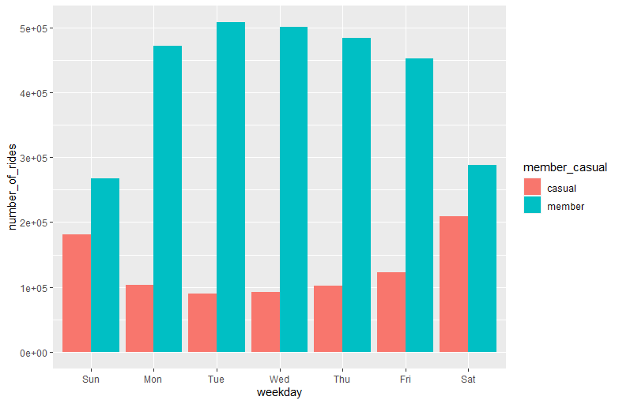
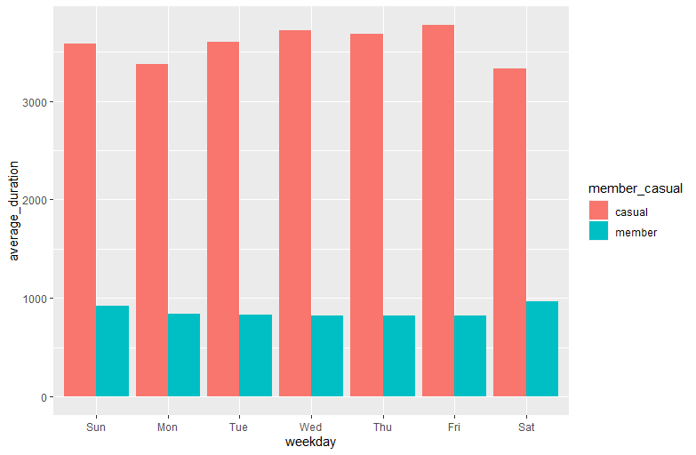
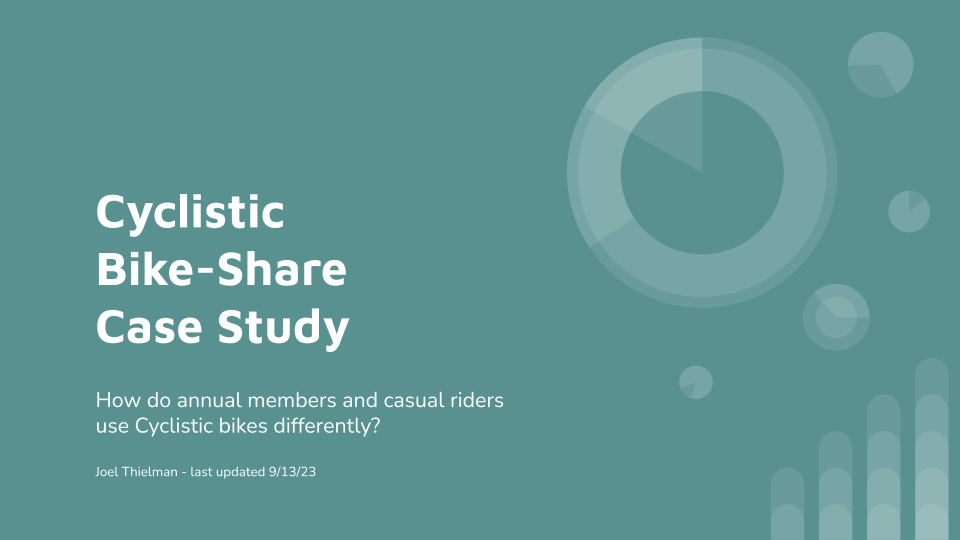
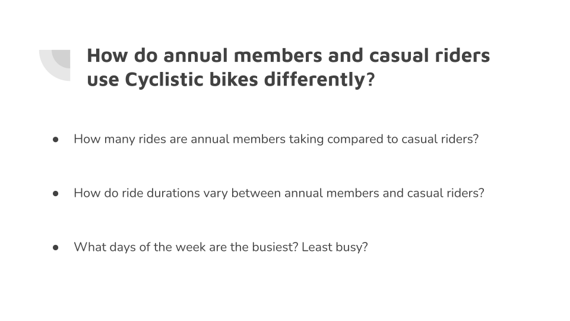
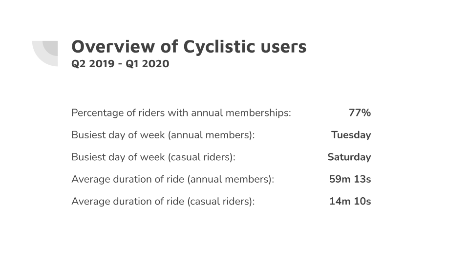
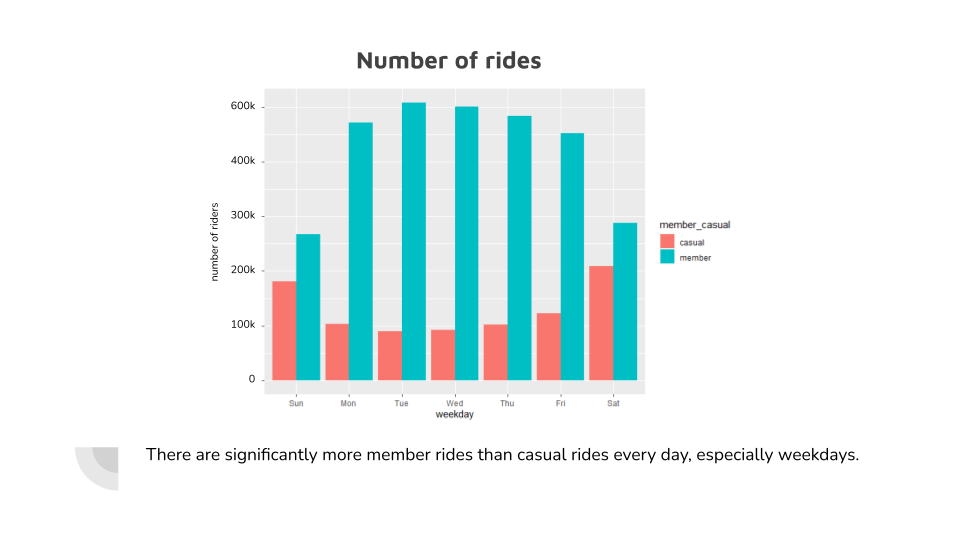
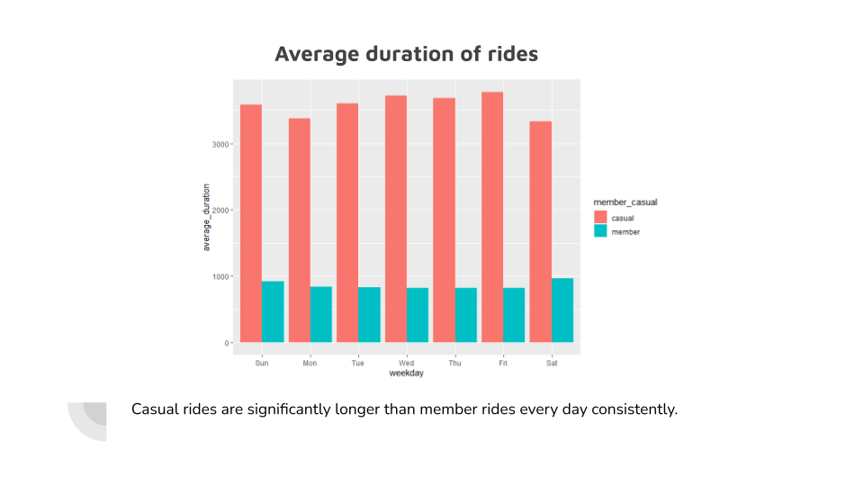
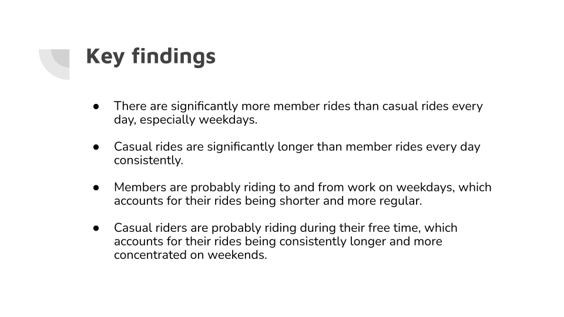

# Cyclistic Case Study

This analysis is for case study 1 from the Google Data Analytics Certificate
(Cyclistic).  It’s originally based on the case study "'Sophisticated, Clear,
and Polished’: Divvy and Data Visualization" written by Kevin Hartman (found
here: https://artscience.blog/home/divvy-dataviz-case-study). We will be using
the Divvy dataset for the case study. The purpose of this script is to
consolidate downloaded Divvy data into a single dataframe and then conduct
simple analysis to help answer the key question: “In what ways do members and
casual riders use Divvy bikes differently?”

```
library(tidyverse)  #helps wrangle data
library(lubridate)  #helps wrangle date attributes
library(ggplot2)  #helps visualize data
getwd() #displays your working directory
setwd("~/Capstone Project/Data/Raw data") #sets your working directory to simplify calls to data
```

# STEP 1: COLLECT DATA

```
# Upload Divvy datasets (csv files) here
q2_2019 <- read_csv("Divvy_Trips_2019_Q2.csv")
q3_2019 <- read_csv("Divvy_Trips_2019_Q3.csv")
q4_2019 <- read_csv("Divvy_Trips_2019_Q4.csv")
q1_2020 <- read_csv("Divvy_Trips_2020_Q1.csv")
```

# STEP 2: WRANGLE DATA AND COMBINE INTO A SINGLE FILE

```
# Compare column names each of the files
# While the names don't have to be in the same order, they DO need to match
# perfectly before we can use a command to join them into one file
colnames(q3_2019)
colnames(q4_2019)
colnames(q2_2019)
colnames(q1_2020)
```

#### Rename columns  to make them consistent with q1_2020
```
(q4_2019 <- rename(q4_2019
                   ,ride_id = trip_id
                   ,rideable_type = bikeid 
                   ,started_at = start_time  
                   ,ended_at = end_time  
                   ,start_station_name = from_station_name 
                   ,start_station_id = from_station_id 
                   ,end_station_name = to_station_name 
                   ,end_station_id = to_station_id 
                   ,member_casual = usertype))

(q3_2019 <- rename(q3_2019
                   ,ride_id = trip_id
                   ,rideable_type = bikeid 
                   ,started_at = start_time  
                   ,ended_at = end_time  
                   ,start_station_name = from_station_name 
                   ,start_station_id = from_station_id 
                   ,end_station_name = to_station_name 
                   ,end_station_id = to_station_id 
                   ,member_casual = usertype))

(q2_2019 <- rename(q2_2019
                   ,ride_id = "01 - Rental Details Rental ID"
                   ,rideable_type = "01 - Rental Details Bike ID" 
                   ,started_at = "01 - Rental Details Local Start Time"  
                   ,ended_at = "01 - Rental Details Local End Time"  
                   ,start_station_name = "03 - Rental Start Station Name" 
                   ,start_station_id = "03 - Rental Start Station ID"
                   ,end_station_name = "02 - Rental End Station Name" 
                   ,end_station_id = "02 - Rental End Station ID"
                   ,member_casual = "User Type"))
```

#### Inspect the dataframes and look for incongruencies
```
str(q1_2020)
str(q4_2019)
str(q3_2019)
str(q2_2019)
```

#### Convert ride_id and rideable_type to character so they can stack correctly
```
q4_2019 <-  mutate(q4_2019, ride_id = as.character(ride_id)
                   ,rideable_type = as.character(rideable_type)) 
q3_2019 <-  mutate(q3_2019, ride_id = as.character(ride_id)
                   ,rideable_type = as.character(rideable_type)) 
q2_2019 <-  mutate(q2_2019, ride_id = as.character(ride_id)
                   ,rideable_type = as.character(rideable_type)) 
```

#### Stack individual quarter's data frames into one big data frame
```
all_trips <- bind_rows(q2_2019, q3_2019, q4_2019, q1_2020)
```

#### Remove lat, long, birthyear, and gender fields as this data was dropped beginning in 2020
```
all_trips <- all_trips %>%  
  select(-c(start_lat, start_lng, end_lat, end_lng, birthyear, gender,
            "01 - Rental Details Duration In Seconds Uncapped", "05 - Member
            Details Member Birthday Year", "Member Gender", "tripduration"))
```

# STEP 3: CLEAN UP AND ADD DATA TO PREPARE FOR ANALYSIS

#### Inspect the new table that has been created
```
colnames(all_trips)  #List of column names
nrow(all_trips)  #How many rows are in data frame?
dim(all_trips)  #Dimensions of the data frame?
head(all_trips)  #See the first 6 rows of data frame.  Also tail(qs_raw)
str(all_trips)  #See list of columns and data types (numeric, character, etc)
summary(all_trips)  #Statistical summary of data. Mainly for numerics
```

#### There are a few problems we will need to fix:

1. In the "member_casual" column, there are two names for members ("member"
and "Subscriber") and two names for casual riders ("Customer" and "casual").
We will need to consolidate that from four to two labels.
2. The data can only be aggregated at the ride-level, which is too granular.
We will want to add some additional columns of data -- such as day, month, year
-- that provide additional opportunities to aggregate the data.
3. We will want to add a calculated field for length of ride since the 2020Q1
data did not have the "tripduration" column. We will add "ride_length" to the
entire dataframe for consistency.
4. There are some rides where tripduration shows up as negative, including
several hundred rides where Divvy took bikes out of circulation for Quality
Control reasons. We will want to delete these rides.

#### In the "member_casual" column, replace "Subscriber" with "member" and "Customer" with "casual"

#### Begin by seeing how many observations fall under each usertype
```
table(all_trips$member_casual)
```

#### Reassign to the desired values (we will go with the current 2020 labels)
```
all_trips <-  all_trips %>% 
  mutate(member_casual = recode(member_casual
                                ,"Subscriber" = "member"
                                ,"Customer" = "casual"))
```

#### Check to make sure the proper number of observations were reassigned
```
table(all_trips$member_casual)
```

#### Add columns that list the date, month, day, and year of each ride

#### This will allow us to aggregate ride data for each month, day, or year
```
all_trips$date <- as.Date(all_trips$started_at) #The default format is yyyy-mm-dd
all_trips$month <- format(as.Date(all_trips$date), "%m")
all_trips$day <- format(as.Date(all_trips$date), "%d")
all_trips$year <- format(as.Date(all_trips$date), "%Y")
all_trips$day_of_week <- format(as.Date(all_trips$date), "%A")
```

#### Add a "ride_length" calculation to all_trips (in seconds)
```
all_trips$ride_length <- difftime(all_trips$ended_at,all_trips$started_at)
```

#### Inspect the structure of the columns
```
str(all_trips)
```

#### Convert "ride_length" from Factor to numeric so we can run calculations on the data
```
is.factor(all_trips$ride_length)
all_trips$ride_length <- as.numeric(as.character(all_trips$ride_length))
is.numeric(all_trips$ride_length)
```

#### Remove "bad" data
```
# The dataframe includes a few hundred entries when bikes were taken out of docks
# and checked for quality by Divvy or ride_length was negative
# We will create a new version of the dataframe (v2) since data is being removed
all_trips_v2 <- all_trips[!(all_trips$start_station_name == "HQ QR" | all_trips$ride_length<0),]
```

# STEP 4: CONDUCT DESCRIPTIVE ANALYSIS

#### Descriptive analysis on ride_length (all figures in seconds)
```
mean(all_trips_v2$ride_length) #straight average (total ride length / rides)
median(all_trips_v2$ride_length) #midpoint number in the ascending array of ride lengths
max(all_trips_v2$ride_length) #longest ride
min(all_trips_v2$ride_length) #shortest ride
```

#### You can condense the four lines above to one line using summary() on the specific attribute
```
summary(all_trips_v2$ride_length)
```

#### Compare members and casual users
```
aggregate(all_trips_v2$ride_length ~ all_trips_v2$member_casual, FUN = mean)
aggregate(all_trips_v2$ride_length ~ all_trips_v2$member_casual, FUN = median)
aggregate(all_trips_v2$ride_length ~ all_trips_v2$member_casual, FUN = max)
aggregate(all_trips_v2$ride_length ~ all_trips_v2$member_casual, FUN = min)
```

#### See the average ride time by each day for members vs casual users
```
aggregate(all_trips_v2$ride_length ~ all_trips_v2$member_casual + all_trips_v2$day_of_week, FUN = mean)
```

#### Notice that the days of the week are out of order. Let's fix that.
```
all_trips_v2$day_of_week <- ordered(all_trips_v2$day_of_week,
  levels=c("Sunday", "Monday", "Tuesday", "Wednesday", "Thursday", "Friday", "Saturday"))
```

#### Now, let's run the average ride time by each day for members vs casual users
```
aggregate(all_trips_v2$ride_length ~ all_trips_v2$member_casual + all_trips_v2$day_of_week, FUN = mean)
```

#### Analyze ridership data by type and weekday
```
all_trips_v2 %>% 
  mutate(weekday = wday(started_at, label = TRUE)) %>%  #creates weekday field using wday()
  group_by(member_casual, weekday) %>%  #groups by usertype and weekday
  summarise(number_of_rides = n()							#calculates the number of rides and average duration 
            ,average_duration = mean(ride_length)) %>% 		# calculates the average duration
  arrange(member_casual, weekday)								# sorts
```

#### Let's visualize the number of rides by rider type
```
all_trips_v2 %>% 
  mutate(weekday = wday(started_at, label = TRUE)) %>% 
  group_by(member_casual, weekday) %>% 
  summarise(number_of_rides = n()
            ,average_duration = mean(ride_length)) %>% 
  arrange(member_casual, weekday)  %>% 
  ggplot(aes(x = weekday, y = number_of_rides, fill = member_casual)) +
  geom_col(position = "dodge")
```



#### Let's create a visualization for average duration
```
all_trips_v2 %>% 
  mutate(weekday = wday(started_at, label = TRUE)) %>% 
  group_by(member_casual, weekday) %>% 
  summarise(number_of_rides = n()
            ,average_duration = mean(ride_length)) %>% 
  arrange(member_casual, weekday)  %>% 
  ggplot(aes(x = weekday, y = average_duration, fill = member_casual)) +
  geom_col(position = "dodge")
```



# STEP 5: EXPORT SUMMARY FILE FOR FURTHER ANALYSIS

#### Create a csv file that we will visualize in Excel, Tableau, or my presentation software
```
counts <- aggregate(all_trips_v2$ride_length ~ all_trips_v2$member_casual + all_trips_v2$day_of_week, FUN = mean)
write.csv(counts, "~/Capstone Project/Data/avg_ride_length.csv")
```

# STEP 6: PRESENT KEY FINDINGS TO STAKEHOLDERS








